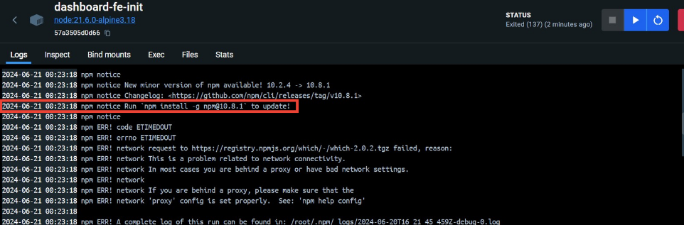
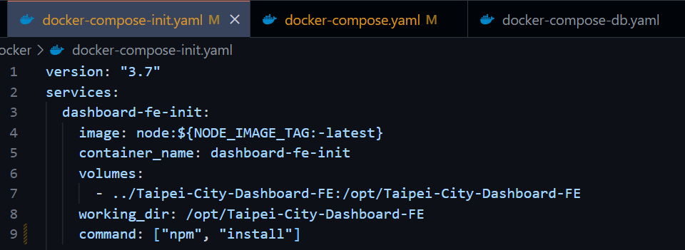
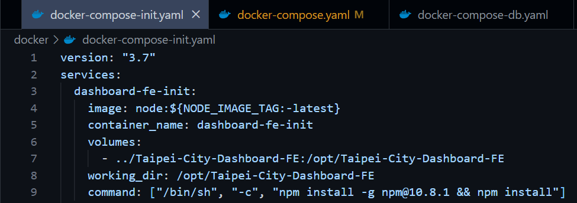
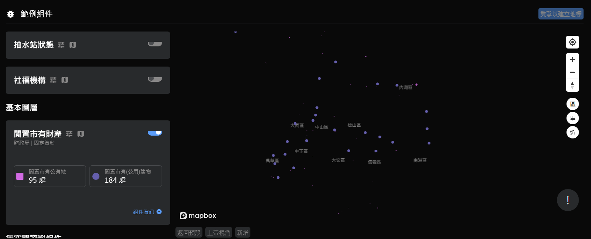

# Taipei City Dashboard

## 競賽議題 & 子議題

- 團隊名稱：SususuSuperCola
- 成員姓名：葉秋彤, 林郁倫, 王岳華, 黃亭蓉
- 競賽議題：公創新世代：學生力量與科技共創公民參與
    - 子議題：智慧城市 X 臺北市政府資訊局

### 專案簡介

- 用途/功能：
    - 助於用戶客觀分析既有事實
    - 透過視覺化的數據平台，對社會政策進行改善
        - 臺北市政府的各處室相關人員，可透過臺北城市儀表板，針對關注的議題，透過儀表板上的視覺化數據進行分析和參考，例如: 板南線的人潮總是在尖峰時段擁擠不已，對於這種情況，政府可能在各站別增派人員以協助動線的指揮，或是增設更多種交通方式等等。
- 目標客群 & 使用情境：
    - 協助相關公務人員做政策決定，透過整合臺北市的各項公開資料，使決策者可參考儀表板上的統合數據了解總體的狀況，例如：跨年時，捷運或者廣場總是聚集許多人潮，決策者可參考儀表板上的即時資訊是否增加警力等等
    - 協助人民了解臺北市地區的各項數據指標，如交通系統、城市結構等資訊
- 操作方式：
    - 環境設置：參考官方文件與影片中的環境建置指南
        1. https://tuic.gov.taipei/documentation/front-end/project-setup
        2. https://www.youtube.com/watch?v=6Qrf_6e9rGY&t=4309s
    - 使用者操作方式
        - 在登入後右上角有太陽的icon，點擊會切換模式，有白天跟黑夜兩個版本
        - 在鼠標移動到右上角的icon時，會有響應式動畫
        - 在頁面最上的地方有一塊區域，會有臺北市吉祥物熊讚的gif在上面跑
        - 如果想回到頁面的最上方，可以按右下角的按鈕，即可返回頁面的最上方
        - 右上角有解說的icon，點擊之後會有臺北城市儀表板的一些操作教學，可以讓使用者更了解操作方式
        - 頁面的最下方有頁尾，有一些臺北市儀表版的相關資訊

### 使用資源

- 企業資源：
    - 臺北大數據中心 [Taipei City Dashboard](https://github.com/tpe-doit/Taipei-City-Dashboard)

### 你還想分享的事情

- 起初發想過程
    
    > 根據了資訊局講師的建議時程，在結束工作坊後，我們就開始發想有什麼創意可以加在功能已經很完善的臺北大數據儀表板上。但雖然大家的想法多多，聽起來如果成功後將會是很完美的一個專案。不過「理想很豐滿，現實很骨感」，我們還是需要衡量一下自己那弱弱(? 的實力。
    > 
- 開發過程
    
    > 在學校其實沒有很多機會同時接觸前後端的技術，因此起初知道我們是要「改善」現有的專案的時候，不免有一些擔憂，害怕自己完全看不懂別人寫的code。幸好，在工作坊的加成下，透過了學習如何調整白天/夜晚模式，讓我們更加了解開發者們撰寫程式的邏輯。而後，我們也自行優化了這項功能。不論是在哪一個頁面，模式都能夠順利轉換，不會有突兀的地方。
    > 
    
    > 在開發我們自己的專案時，主打一個「想多炫炮，就要有多炫炮」。因為我們這隊想要打造的儀表版是一個要讓使用者有使用慾望的網站，並且不論老少，都能夠更便捷的操作，因此多加了響應式功能，像是碰觸按鈕時的動畫、立即回到組件頁面最上方的快捷鍵。
    > 
    > 
    > 除此之外，因為這是一個屬於「臺北市」的大數據儀表板，因此我們想到了臺北市的吉祥物—熊讚。並以跑馬燈的方式讓吉祥物在網頁頂端跑動，增加趣味性。也可以吸引到年輕族群的目光。
    > 
    > 不過，一個網站不能光只有炫炮的功能，若是使用者還是不會操作，不了解一些功能存在的價值，那這個網站就只能充當一個花瓶的角色。所以我們在網頁的右上角區域增加了一個網站導覽的功能。按下後會顯示一個小視窗，裡面就包含了登入方式、簡易功能介紹等資訊。目前，我們只有增加了四個操作的說明，分別是登入功能、收藏組件、新增個人儀表板及刪除個人儀表板，未來如有需要，後續的開發者也可以在自行增加/刪減。
    > 
- 遇到的困難
    - 安裝docker環境遇到困難
        
        > 我們組有組員沒學過網頁程式設計，因此在準備儀表環境時，所有套件都會根據系統所配置的版本進行安裝，但這就導致出現下列情況：
        > 
        > - 套件版本過舊
        > - 套件之間的版本不匹配
        > 
        > 而我們主要遇到的是「套件之間的版本不匹配」，這邊將以「安裝docker時，設定Front-End-init的Container所遇到的npm版本問題」為例。
        > 
        > 組員自述辛酸血淚史：
        > 
        > 因為沒學過網頁程式設計，所以沒有很懂npm、docker、yaml檔之類的東西是甚麼，而在照著資訊局所提供的使用文件設定環境時遇到以下情況(心裡想說…我就知道沒那麼順利!!! 吐血😢)，dashboard-fe-init底下出現ERR啊啊啊啊啊啊啊啊啊啊啊啊啊啊啊😱
        > 
        > 
        > 
        > 看起來就是和npm的版本有關係啊啊啊啊啊啊啊啊啊啊啊，阿可是我又不懂這是甚麼…所以就是一直Google、AI、Google、AI、Google……結果最後還是甚麼都看不懂QQ，想說算了，到時候工作坊的時候再來提問好了(在工作坊之前的期間遇到的問題)，然後偶然點開docker設定用的yaml檔，發現有npm這個關鍵字耶!!! 
        > 
        > 
        > 
        > 然後下面的command有寫到install😍😍 太好了都是keyword，就去查command的語法結構是甚麼，把它改成我要的指定版本~ 像下面這樣~ 
        > 
        > 
        > 
        > 然後重新運行docker，我就安詳了(x) 他就成功執行起來了(大開心!)
        > 
    - 更改模式遇到的困難
        
        > 工作坊已經有教初步的更改模式了，但有些地方的顏色因為一開始是寫死的，或是一開始顏色變數填的數值不符合該原件，在黑夜模式看起來沒問題，但更換顏色的時候會有些突兀或不清楚，所以我們有再做更改。
        > 
        > 
        > 因為整個頁面都是有顏色的，所以顏色相關的程式碼很多，且散落在各個地方，需要多次確認各個功能的顏色是否是我們所期望的，看有沒有哪些地方是需要再更改的。
        > 
    - 資料庫建立的困難
        
        > 在實作「組件許願池」這個功能時，我們選擇參考問題回報功能的程式撰寫邏輯。在寫完前端後，我們發現這項功能有牽扯到後端呼叫API，以及資料儲存 (令人頭痛的東西來了 so sad…. )
        > 
        > 
        > 根據程式儀表板的官方說明文件，建立資料庫可以使用官方釋出的程式建立SQL指令，再自行到pgAdmin中輸入指令以建立相關資料庫。但在實作的過程中，雖然指令已經順利產生，但我們卻找不到可以輸入SQL指令的terminal，因此最後只能完成這項功能的前端QQ
        > 
    - 跑跑熊讚
        
        > 為了使 gif 圖檔在移動的過程中也能呈現原本動態的效果，嘗試許多方式，一開始是使用畫圖的方式，但每次都只會畫第一張圖，使熊讚並不會有動作，最後使用 @keyframe 函式控制熊讚的移動狀況，同時也使圖片能呈現原始的動態效果。
        > 
    - 地圖底圖失蹤
        
        > 新增一些功能之後，發現「地圖交叉比對」的地方沒有底圖了!!!
        > 
        > 
        > 
        > 
        > 但無論怎麼翻找程式碼都沒有動到和mapbox(線上地圖)有關的地方，最後自己De不出Bug，就向開發者提出疑問了，而他給的回應是說：
        > 
        > - 可能是mapbox 金鑰的問題
        > - 檢查 localhost 有沒有在金鑰的白名單中
        > - 打開開發者模式檢查
        > - 或看看文件環境建置部分的說明
        > 
        > 根據他的說法，我們還是沒有成功讓底圖的部分顯現出來。
        > 
        > 最後解法：換台筆電就成功了!
        > 

### 成果展示

- https://www.canva.com/design/DAGJxMnMTxQ/xxbPBEHfcF36ygstcwHPaA/view?utm_content=DAGJxMnMTxQ&utm_campaign=designshare&utm_medium=link&utm_source=editor
